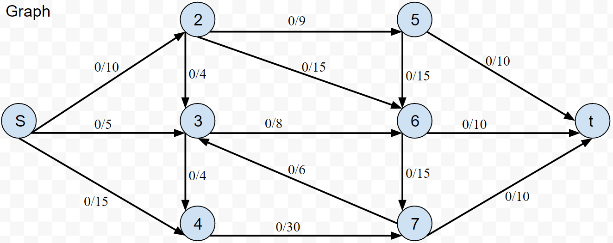
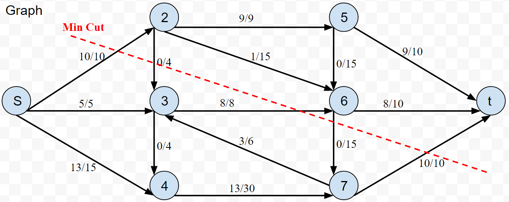
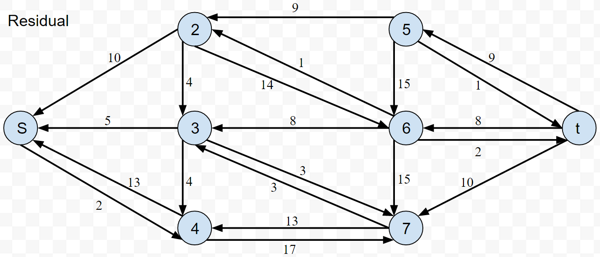

# Ford Fulkerson Max-Flow / Min Cut Algorithm
Simple implementation to find the maximum flow through a flow network (no Capacity Scaling)

*"0/10" means an edge with **capacity 10** and **0 flow assigned***  

## Terminology
- **Residual graph**  
Directed graph showing how much of the flow assignments can be undone  
Edge `e=(u,v)` shows how much flow is left to be assigned to that edge  
Edge `e=(v,u)` is how much flow already been assigned (how much ca be undone)
- **Augmentation Path**  
An arbitrary path from **S** to **T** found in residual graph
- **Bottleneck**  
Minimum capacity from the path found in the residual graph (**how much flow is assigned after each path is found**)

## Usage
- `vertexCount` must be hard coded for different graphs
- Code deals directly with integer array indexes. Index 0 is **S** (source) and index `vertexCount-1` is **T** (sink) (-1 since arrays count from 0)
- `arrayIndexStringEquivalents` holds string equivalents of the index. So vertices can have humanly readable IDs like S & T, and don't have to be sequential integers
  - `arrayIndexStringEquivalents[1]` is `2` because the vertex called "2" is the in position `1` in the array indexes
- Graphs are represented as **adjacency matrices**
  - Directed Graph so order matters
  - `graphMatrix[i][j]` represents the capacity of an edge **from i to j**
    - `0` if no edge exists
    - **No vertex has an edge to itself. There should always be a `0` in `graphMatrix[x][x]`**
      - `graphMatrix[0][0]` is `0` since S has no edges to itself
      - Same for all vertices
      - `graphMatrix[1][1]` is `0` since the vertex in position 1 (**vertex "2"**) has no edges to itself, etc.
    - Row `vertexCount-1` is always all `0`'s since **T** (the sink) has **NO** outgoing edges `{0, 0, 0, 0, 0, 0, 0, 0}`

### Final Flow Network

### Final Residual Graph

## Max Flow = 28

## Code Details
- Constructor takes in an array of strings to have human readable vertices instead of `int`s
- `maxFlow()` finds the maximum flow through the network
  - Creates a residual graph & leaves the original graph unchanged
- Uses Breadth First Search `bfs()` to find augmentation paths
  - Returns `true`/`false` if a path from **S** to **T** was found
  - Updates `parent[]` array so the actual path can be found
- `maxFlow()` outputs each augmentation path found & the amount of flow added to total flow (`bottleck`)

### Improvements
Capacity scaling
1. Find capacity of S (sum all outgoing edges)
2. delta = Math.floor(log_2(capacity) ) (log base 2)
3. BFS unchanged, after find bottleck, if bottleneck<delta `continue` & skip current loop
4. cut delta in half @ end of `while`
